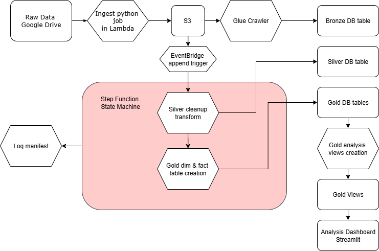
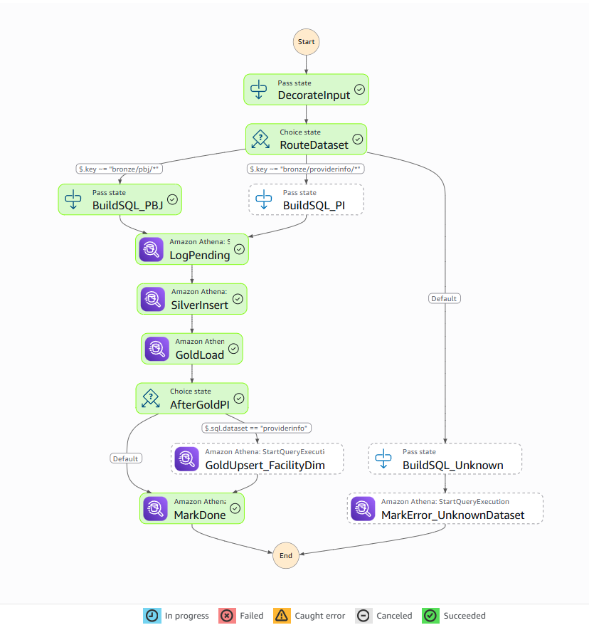

# Pipeline Documentation — Kerok Healthcare AWS Data Lakehouse

## 1. Overview
This document explains the architecture, workflow, and reasoning behind the **Kerok Healthcare Data Pipeline** — a modern AWS-native lakehouse designed to process healthcare staffing and provider quality data using a **Medallion architecture** (Bronze → Silver → Gold).

The diagram below illustrates the architecture at a high level:

---

## 2. Architecture Summary

### 2.1. Core AWS Components
| Component | Purpose | Description |
|------------|----------|--------------|
| **Amazon S3** | Data Lake Storage | Stores all raw and processed data organized in Bronze, Silver, and Gold layers. |
| **AWS Lambda** | Ingestion from Google Drive | Fetches .csv files from Google Drive and uploads to S3 (`bronze/pbj/`, `bronze/providerinfo/`). |
| **Amazon EventBridge** | Event-driven trigger | Detects new .csv uploads and triggers Step Functions. |
| **AWS Step Functions** | Orchestration | Executes ETL jobs, calling Athena queries to merge and transform data between layers. |
| **AWS Glue Data Catalog** | Metadata registry | Centralized schema definitions for all tables (Bronze, Silver, and Gold). |
| **Amazon Athena (Engine v3)** | SQL compute engine | Executes MERGE, CREATE TABLE, and CREATE VIEW operations using Iceberg format. |
| **Apache Iceberg** | Table format | Enables ACID operations, schema evolution, and incremental appends. |
| **Streamlit (PyAthena)** | Analytics dashboard | Provides visualization and analysis front end for Gold views. |

---

## 3. Data Flow

### 3.1. Ingestion (Bronze Layer)
1. **Lambda** fetches .csv files from Google Drive.
2. Files are written to S3 under:
   - `s3://kerok-healthcare-landing/bronze/pbj/`
   - `s3://kerok-healthcare-landing/bronze/providerinfo/`
3. **EventBridge** triggers when a new object is created in either prefix.

### 3.2. Transformation (Silver Layer)
1. Step Functions orchestrates Athena `MERGE` queries to normalize and clean Bronze data:
   - Fix data types with `try_cast()`
   - Normalize text and identifiers (e.g., zero-padding CCNs)
   - Coalesce duplicate rows on matching `ccn`
2. Writes to **Iceberg tables** in:
   - `s3://kerok-healthcare-landing/silver/pbj/`
   - `s3://kerok-healthcare-landing/silver/providerinfo/`

### 3.3. Aggregation (Gold Layer)
1. Step Functions executes additional Athena queries to:
   - Aggregate staffing metrics into **Gold Fact tables**
   - Build **Facility Dimension tables** for joinable metadata
2. Tables:
   - `gold_daily_staffing_fact`
   - `gold_quarterly_provider_fact`
   - `gold_facility_dim`
3. Views created for analysis (HPRD, staffing mix, utilization).

---

## 4. State Machine Design

### 4.1. Branching Logic
The Step Function contains **two parallel branches**:
- **ProviderInfo track (PI)** → runs ProviderInfo Silver & Gold transformations, including `gold_facility_dim`.
- **PBJ track** → runs PBJ Silver & Gold transformations (staffing fact table).

Each branch defines:
- `BuildSQL_*` (template substitution)
- `AthenaQueryExecution`
- `GoldUpsert_*`
- `MarkDone`

### 4.2. Error Handling
- `Catch` blocks handle transient Athena or Step Function errors.
- Partial results (e.g., failed gold stage) are retried or skipped to avoid partial re-ingestion.
- Non-atomic behavior mitigated through unique file-level ingestion and CCN-based MERGE keys.

---

## 5. Data Lake Layers Summary

| Layer | Storage Format | Description |
|--------|----------------|--------------|
| **Bronze** | CSV (external) | Raw ingested data from Google Drive |
| **Silver** | Iceberg (Parquet) | Cleaned, typed, deduplicated data |
| **Gold** | Iceberg (Parquet) | Aggregated fact/dimension tables and views for BI consumption |

---

## 6. Security and Governance
- Access controlled via IAM Roles for Lambda, Step Functions, and Athena.
- Athena workgroup `primary` configured with S3 output bucket:
  `s3://kerok-athena-query-output-storage-v1/`
- Glue Catalog manages schema evolution under database `kerok-healthcare-bronze`.

---

## 7. Dashboard Integration
- The Streamlit dashboard connects via **PyAthena**, reading from **Gold** views.
- Metrics visualized:
  - Facility & state HPRD (Hours per Resident per Day)
  - Staffing mix (employee vs contract)
  - Bed utilization
  - Staffing vs occupancy scatter
- Caching and pagination ensure performance and cost efficiency.

---

## 8. Rationale for Technology Choices

| Component            | Reasoning                                                                                        |
|----------------------|--------------------------------------------------------------------------------------------------|
| **AWS Native Stack** | Fully managed, low-maintenance, cost-effective for small-scale healthcare data.                  |
| **Lambda Extract**   | Lightweight service for incremental incoming monthly or quarterly bulk data.                     |
| **Step Functions**   | Clear visual orchestration, easy parallelization and error recovery.                             |
| **Athena + Iceberg** | Serverless SQL compute with ACID merges and schema evolution.                                    |
| **Glue Catalog**     | Schema registry that integrates seamlessly with Athena and S3.                                   |
| **Streamlit**        | Rapid, Python-native visualization layer for analytics without deploying full BI infrastructure. |

---

## 9. Deployment Notes
- All SQL scripts are stored in `/sql/` and referenced in Step Function parameters.
- Streamlit app resides in `/app.py`.
- The complete pipeline can be deployed with minimal infrastructure—no EC2 or EMR needed.

---

## 10. References
- `docs/kerok_healthcare_aws_drawio.png` — pipeline architecture diagram  
- CMS Data Documentation (PBJ, Provider Info)
- AWS Iceberg & Athena Documentation
- Streamlit and PyAthena guides
